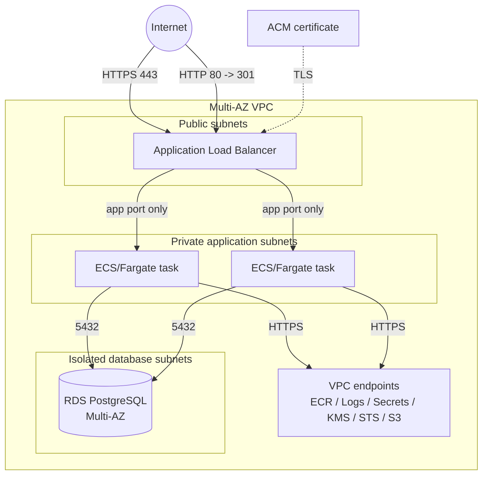

# Architecture

## Intent

This blueprint models a small production service with three explicit trust zones:

1. **Public edge**: an Application Load Balancer accepts HTTP/HTTPS. HTTP is redirected to HTTPS.
2. **Application tier**: ECS/Fargate tasks run without public IP addresses in private subnets.
3. **Data tier**: PostgreSQL runs in isolated subnets with no internet route and accepts traffic only from the application security group.

The design uses AWS-managed primitives and keeps critical authority in infrastructure boundaries rather than application convention.

## Subnet model

The VPC is divided into separate public, application, and database CIDR ranges in each selected Availability Zone.

- Public subnets route `0.0.0.0/0` through an Internet Gateway.
- Application subnets do not receive public IP addresses.
- Database subnets have no default internet route.
- Each application AZ has its own route table so egress behavior can be changed without collapsing the trust boundary.

The default is two Availability Zones. A single-AZ production layout is intentionally rejected by input validation.

## Private AWS service access

With `create_vpc_endpoints = true`, the application tier receives private access to:

- ECR API
- ECR Docker registry
- CloudWatch Logs
- Secrets Manager
- KMS
- STS
- S3 through a gateway endpoint

This allows a private ECR-hosted workload to start, retrieve its database credential, publish logs, and call required AWS APIs without a general internet route.

## Internet egress modes

`nat_gateway_mode` is explicit:

- `none` is the secure default. No general internet route exists from the application subnets.
- `single` creates one NAT Gateway and points all application AZs at it. This reduces cost but creates an AZ dependency for outbound traffic.
- `per_az` creates one NAT Gateway per application AZ. This is the resilient choice when the workload genuinely requires outbound internet access.

A configuration with neither VPC endpoints nor NAT egress fails a Terraform check because the private runtime would be unable to reach required AWS services.

## Request path

The ALB is the only public application ingress point. Its security group accepts ports 80 and 443 from the configured CIDRs. Port 80 performs a redirect. The ALB may send traffic only to the application security group on `app_port`.

Application tasks accept `app_port` only from the ALB security group. The database accepts PostgreSQL only from the application security group.

## Credential path

RDS generates and rotates ownership of the master credential through Secrets Manager via `manage_master_user_password`.

The task receives the **secret ARN**, not the password, as an environment value. Its task role is permitted to read that one database secret and decrypt it with the blueprint data key. The application is expected to retrieve the secret at runtime.

This separates deployment configuration from secret material and avoids placing database passwords in Terraform variables or task-definition plaintext.

## Deployment behavior

The ECS service starts at a minimum of two tasks, uses a deployment circuit breaker with automatic rollback, and is registered behind an IP target group. Application Auto Scaling owns desired-count changes after creation, using CPU target tracking within `desired_count` and `max_task_count` bounds.

Terraform ignores runtime drift in the ECS desired count so a later infrastructure apply does not fight the autoscaler.

## Data resilience

The production defaults enable:

- RDS Multi-AZ
- seven-day automated backup retention
- encrypted gp3 storage
- storage autoscaling
- deletion protection
- final snapshot on destroy
- PostgreSQL and upgrade log export
- Performance Insights

These are defaults, not substitutes for workload-specific RTO/RPO design.

## Deliberate boundaries

This repository does not pretend that one Terraform stack is a complete enterprise platform. Organization-level controls such as AWS Organizations/SCPs, GuardDuty, Security Hub, centralized CloudTrail, WAF policy, image signing, DNS, remote-state bootstrap, and cross-account deployment belong outside this service-level reference architecture.
